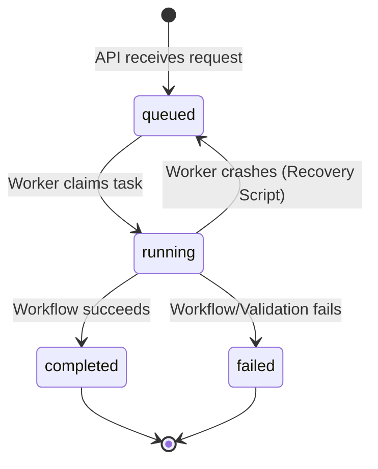
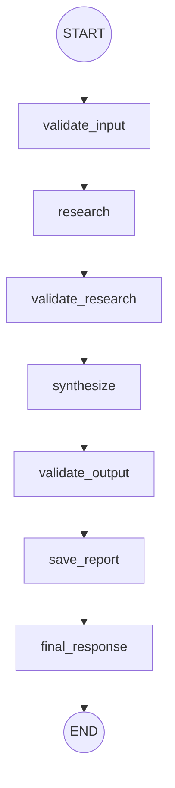

# Architecture

The AI Research Agent provides a production-grade backend and a modern React frontend for conducting autonomous multi-step research. It utilizes large language models and search engines to gather, synthesize, and persist factual research reports autonomously based on user queries.

## 1. System Overview
The architecture is decoupled into three primary operational tiers:
1.  **Frontend (React/Vite)**: Provides an interactive UI for submitting queries, polling task status, rendering Markdown summaries, displaying source links, and downloading the final `.txt` report.
2.  **API (FastAPI)**: Serves as the gateway for the frontend. Handles task submission, manages task states in Redis, and exposes retrieval endpoints for task data and raw reports.
3.  **Worker (Python Daemon)**: An independent background process that listens to the Redis queue, claims tasks, executes the LangGraph workflow, invokes external search tools and the Groq LLM, and persists the final results to disk and Redis.

## 2. Component Responsibilities

### Frontend (React + Vite)
-   **App/Sidebar**: Manages task history state and user navigation.
-   **Services (`researchApi.js`)**: Encapsulates all interactions with the FastAPI backend, including polling for task completion (`queued` -> `running` -> `completed`/`failed`).
-   **Result Rendering (`ResearchResult.jsx`)**: Uses `react-markdown` to safely render the ~300-line summary preview. Correlates structured source arrays to generate real clickable hyperlinks.

### Backend (FastAPI - `api.py`)
-   **Task Queueing**: Generates a UUID for incoming requests, initializes task metadata in a Redis Hash (`task:{id}`), and pushes the ID to a Redis List (`research:queue`).
-   **CORS**: Configured to accept cross-origin requests from the Vite development servers.
-   **Retrieval**: Provides endpoints to fetch task status (`/api/v1/research/{id}`) and download the raw text report (`/api/v1/research/{id}/report`).

### Task Queue (Redis)
-   **Persistence**: Holds task metadata and prevents data loss between the API and the worker.
-   **Processing Queue**: Implements an atomic queue (via Lua scripting and `BRPOPLPUSH`/`BLMOVE`) to guarantee exactly-once delivery and support worker failure recovery.

### Worker Node (`worker.py`)
-   **Lifecycle**: Runs in an infinite loop, performing a blocking pop on the Redis queue.
-   **State Management**: Atomically transitions tasks from `queued` to `running`, and upon completion or failure, to `completed` or `failed`.
-   **Error Handling**: Employs robust `try/except` blocks and Lua scripts to ensure task states accurately reflect pipeline crashes or concurrent modifications.

### LangGraph Workflow (`research_workflow.py`)
-   **Orchestration**: Models the research process as a directed graph (StateGraph).
-   **Nodes**:
    -   `validate_input`: Verifies the query structure.
    -   `research`: Invokes search tools concurrently.
    -   `validate_research`: Confirms tools returned adequate data.
    -   `synthesize`: Compiles raw search data and prompts the Groq LLM for an executive summary and detailed findings.
    -   `validate_output`: Ensures the LLM output meets criteria.
    -   `save_report`: Writes the synthesized report to the local file system.
    -   `final_response`: Prepares the final summary and source array.

### Research Tools (`tools.py`)
-   **DuckDuckGo**: Utilizes `DuckDuckGoSearchResults` to retrieve structured search metadata (titles, snippets, URLs).
-   **Wikipedia**: Utilizes `WikipediaQueryRun` to retrieve encyclopedic content (returned as plain text without URLs).

### Report Storage
-   Reports are saved locally to the `reports/` directory with a standardized timestamped filename (`research_<query>_<timestamp>.txt`). The filename is stored in Redis so the API can resolve it for download.

## 3. Diagrams

### High-Level Architecture
```mermaid
flowchart TD
    Client[React Frontend] -->|REST API| API[FastAPI]
    API -->|Push Task ID| Queue[(Redis: research:queue)]
    API -->|Write State| Hash[(Redis: task:{id})]
    Worker[Python Worker] -->|Pop Task ID| Queue
    Worker -->|Update State| Hash
    Worker -->|Invoke| LangGraph[LangGraph Workflow]
    LangGraph -->|Search| DDG[DuckDuckGo]
    LangGraph -->|Search| Wiki[Wikipedia]
    LangGraph -->|Synthesize| LLM[Groq LLM]
    LangGraph -->|Write| Disk[reports/ Directory]
    Client -->|Poll Status| API
    Client -->|Download Report| Disk
```

### Task Lifecycle


### Research Workflow Graph


## 4. Current Limitations
-   **Persistence**: Redis is currently a single point of failure. Task metadata and queues are volatile if Redis crashes without AOF persistence. Session history is only stored in React state (lost on page reload).
-   **External Dependencies**: The DuckDuckGo and Wikipedia tools are subject to rate limiting and connectivity issues, which can result in failed tasks.
-   **Source Metadata**: The Wikipedia LangChain tool wrapper returns plain text, so its source attribution in the UI cannot be a clickable link.
